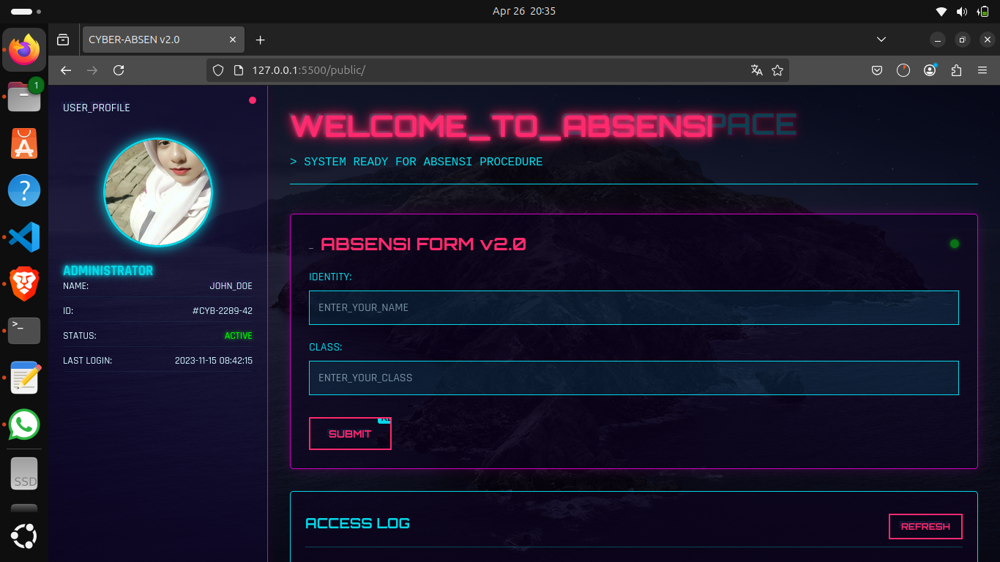

# 🔮 Cyberpunk Absensi Website

 

Website absensi futuristik dengan tema cyberpunk untuk pencatatan kehadiran sederhana.

## ✨ Fitur
- 🌌 Tema neon cyberpunk dengan efek glitch
- 📝 Input nama dan kelas
- 💾 Penyimpanan data berbasis file teks
- 📊 Riwayat absensi real-time
- 📱 Responsif untuk desktop & mobile

## 🛠 Teknologi
- **Frontend**: HTML5, CSS3, JavaScript
- **Backend**: Node.js + Express
- **Database**: File TXT

## 🚀 Cara Install
1. Clone repo:
   ```bash
   git clone https://github.com/RAMALANHEKING99/website
